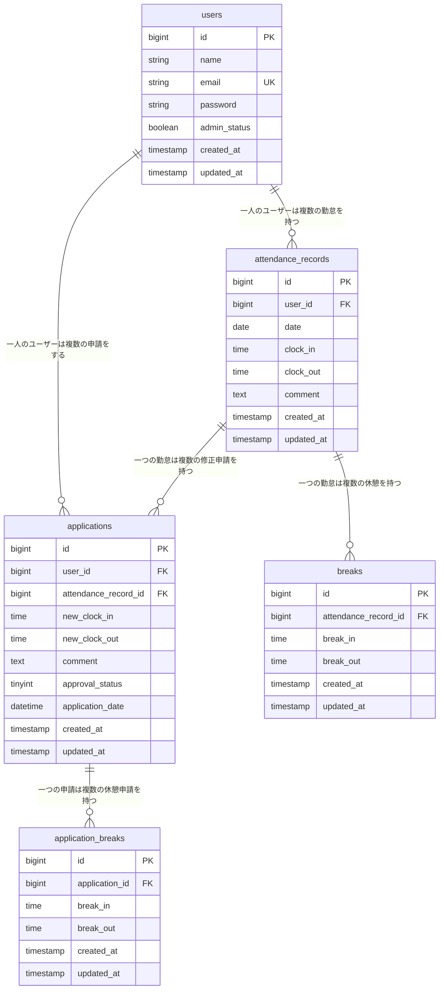

# coachtech 勤怠管理アプリ

## 概要
COACHTECH「新模擬案件_勤怠管理アプリ」で作成した成果物です。
ユーザーの勤怠とその管理を目的とするアプリです。

## 環境構築
### 1.リポジトリのクローン
```bash
git clone https://github.com/hakua411/attendance.git
```
### 2.Laravelプロジェクトの作成 (Laravel 10.x)
Laravel 10.x を指定してプロジェクトを作成
```bash
docker run --rm \
  -u "$(id -u):$(id -g)" \
  -v "$(pwd):/var/www/html" -w /var/www/html \
  -e COMPOSER_CACHE_DIR=/tmp/composer_cache \
  laravelsail/php82-composer:latest \
  composer create-project laravel/laravel:^10.0 attendance-app
```
### 3.Laravel Sailのインストール
プロジェクトディレクトリに移動
```bash
cd attendance-app
```
Laravel Sailをインストール（mysql, mailpit）
```bash
docker run --rm -u "$(id -u):$(id -g)" -v "$(pwd):/var/www/html" -w /var/www/html \
  laravelsail/php82-composer:latest \
  php artisan sail:install --with=mysql,mailpit
```
Apple Silicon(M1/M2/M3/M4等)の場合は compose.yaml の mysql に「platform: 'linux/amd64'」を追記。
### 4. phpMyAdminの追加
compose.yaml を開き、mysql サービスの後に以下の設定を追加してください。
```bash
phpmyadmin:
  image: 'phpmyadmin:latest'
  ports:
    - '${FORWARD_PHPMYADMIN_PORT:-8080}:80'
  environment:
    PMA_HOST: mysql
    PMA_USER: '${DB_USERNAME}'
    PMA_PASSWORD: '${DB_PASSWORD}'
  networks:
    - sail
  depends_on:
    - mysql
```
### 5. .envを編集（DB/メール）
.env ファイルを開き、データベース接続情報が以下と一致していることを確認します。

- DB_CONNECTION=mysql
- DB_HOST=mysql
- DB_PORT=3306
- DB_DATABASE=laravel
- DB_USERNAME=sail
- DB_PASSWORD=password

- MAIL_MAILER=smtp
- MAIL_HOST=mailpit
- MAIL_PORT=1025

DB_HOST は localhost や 127.0.0.1 ではなく、Dockerコンテナ名である mysql を指定します。
### 6. 提供Bladeの移入
- 提供リポジトリ: https://github.com/coachtech-prepared-file/Preparedblade-mockcase-Attendance
- ブランチ:
  
    basic    … 基本機能用
  
    advanced … 応用機能用
- 移入方法:
  1. 自分のプロジェクトとは別の場所で:  git clone -b basic <上記URL>
  2. クローン内の resources/ を、自分のプロジェクトの resources/ に上書きコピー
  3. クローンフォルダは削除
    （応用機能用は branch を advanced にして同手順で再移入）
### 7.フロントエンド（Vite）
vite.config.js を以下の内容に置き換える（提供CSSを個別に入力指定する）
```bash
import { defineConfig } from 'vite';
import laravel from 'laravel-vite-plugin';

export default defineConfig({
  plugins: [
    laravel({
      input: [
        'resources/js/app.js',
        'resources/css/sanitize.css',
        'resources/css/common.css',
        'resources/css/auth/verify-email.css',
        'resources/css/user/register.css',
        'resources/css/user/user-login.css',
        'resources/css/user/attendance-register.css',
        'resources/css/user/user-attendance-list.css',
        'resources/css/user/user-detail.css',
        'resources/css/user/user-application-list.css',
        'resources/css/admin/admin-login.css',
        'resources/css/admin/admin-attendance-list.css',
        'resources/css/admin/admin-detail.css',
        'resources/css/admin/admin-application-list.css',
        'resources/css/admin/admin-application-detail.css',
        'resources/css/admin/staff-list.css',
        'resources/css/admin/staff-attendance-list.css',
        'resources/css/reports/index.css', 
      ],
      refresh: true,
    }),
  ],
});
```
### 8.アプリ起動 & 初期化
```bash
 ./vendor/bin/sail up -d
```
```bash
 ./vendor/bin/sail artisan key:generate
```
```bash
 ./vendor/bin/sail artisan migrate --seed
```
```bash
 ./vendor/bin/sail npm install
```
```bash
 ./vendor/bin/sail npm run dev
```
   （エイリアス推奨: alias sail='[ -f sail ] && bash sail || bash vendor/bin/sail'）

## ログイン情報
- ユーザー1（一般）: user1@example.com / password
- ユーザー2（一般）: user2@example.com / password
- ユーザー3（管理者）: user3@example.com / password

## 使用技術
- PHP 8.2
- Laravel 10.0
- MySQL 8.4

## ER図


## URL
- 開発環境:http://localhost
- phpMyAdmin:http://localhost:8080
- Mailpit: http://localhost:8025
